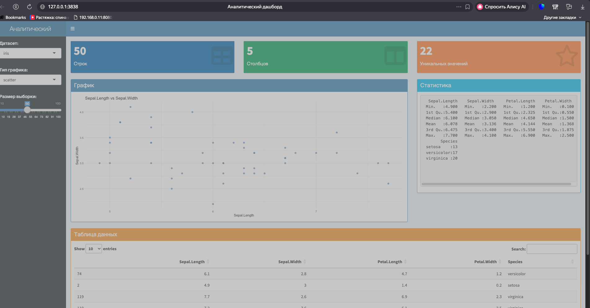

# Аналитический дашборд на R Shiny

Интерактивный веб-дашборд для анализа данных, построенный на фреймворке [Shiny](https://shiny.posit.co/) с использованием [shinydashboard](https://rstudio.github.io/shinydashboard/).

## Возможности

- Выбор датасета: `iris`, `mtcars`, `faithful`
- 4 типа графиков: scatter, bar, histogram, boxplot
- Value boxes с ключевыми метриками (строки, столбцы, уникальные значения)
- Интерактивная таблица данных (DT)
- Настройка размера выборки через слайдер

## Стек

- **Язык:** R
- **UI:** shinydashboard
- **Графики:** ggplot2
- **Обработка данных:** dplyr
- **Таблицы:** DT

## Запуск

```bash
Rscript run.R
```

Приложение откроется в браузере по адресу `http://127.0.0.1:3838`.

### Установка зависимостей (вручную)

```r
install.packages(c("shiny", "shinydashboard", "ggplot2", "dplyr", "DT"))
```

## Структура проекта

```
.
├── app.R       # Основной файл приложения (UI + Server)
├── run.R       # Скрипт запуска с установкой зависимостей
└── README.md
```

## Скриншот


